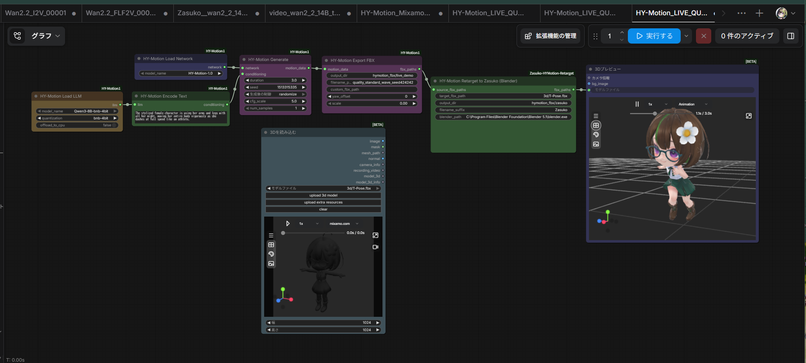

# HY-Motion Extensions: Text-to-Motion → Mixamo FBX Retarget

ComfyUI 上で HY-Motion が生成した人型モーションを、Mixamo リグの T ポーズ FBX キャラクターへ適用する **Windows 向けベータ拡張**です。Blender をバックグラウンド実行し、納品用 FBX と ComfyUI Preview3D 用 GLB を出力します。

> これは HY-Motion の生成モデル本体ではありません。モデル重み、キャラクター FBX、テクスチャは同梱していません。

## できること

- HY-Motion の `HY-Motion Export FBX` 出力を自動で受け取る
- Mixamo の人型ボーンへリターゲットする
- 体格差に合わせてルート移動量を補正する
- 接地位置を補正し、短頭身モデルで腕が胴体へ入りにくいよう上腕へ小さなクリアランスを加える
- 納品向け FBX と、ComfyUI Preview3D で安定表示しやすい in-place GLB を別々に出力する

## 対応範囲と重要な制限

この版で確認できたのは **Windows 11 / ComfyUI v0.28.0 / Blender 5.1 / HY-Motion 1.0 / Mixamo リグの短頭身キャラクター**です。

- 対象は Mixamo の `mixamorig:` ボーン名を持つ人型 FBX。VRM、独自ボーン、非人型、顔・指のアニメーションは未対応です。
- ターゲットはアニメーションなしの T ポーズ FBX を推奨します。
- キャラクターの体型によっては、手足のめり込み・足滑りを完全には防げません。
- Blender の場所は PC によって異なります。ノードの `blender_path` を実際の `blender.exe` に変更してください。
- 信頼できる FBX だけを処理してください。このノードはローカルの Blender Python スクリプトを実行します。

## 必要なもの

1. [ComfyUI](https://github.com/comfyanonymous/ComfyUI)
2. [ComfyUI-HY-Motion1](https://github.com/jtydhr88/ComfyUI-HY-Motion1) と、公式の [HY-Motion 1.0](https://huggingface.co/tencent/HY-Motion-1.0) モデル一式
3. [Blender](https://www.blender.org/download/) 5.1 で確認済み
4. Mixamo リグ済みの T ポーズ FBX

HY-Motion Standard は公式案内で最低 26GB VRAM とされています。短い 3 秒・1 サンプルの検証は RTX 4090 24GB で成功しましたが、配信や安定運用では 32GB 以上の VRAM、64GB RAM、SSD 空き 100GB 以上を推奨します。

## 導入

1. このリポジトリの `ComfyUI-Zasuko-HYMotion-Retarget` フォルダーを、ComfyUI の `custom_nodes` へコピーします。
2. Blender をインストールします。
3. Mixamo リグ済み T ポーズ FBX を `ComfyUI/input/3d/` へ置きます。例: `ComfyUI/input/3d/T-Pose.fbx`
4. ComfyUI を再起動します。
5. `workflows/HY-Motion_LIVE_QUALITY_Zasuko_Test_20260718.json` を読み込み、Load 3D と Retarget ノードのパスを自分の環境に合わせます。

## 配線

```text
HY-Motion Export FBX.fbx_paths
  → HY-Motion Retarget to Zasuko (Blender).source_fbx_paths

Load 3D.mesh_path
  → HY-Motion Retarget to Zasuko (Blender).target_fbx_path

HY-Motion Retarget to Zasuko (Blender).fbx_paths
  → Preview3D.モデルファイル
```

Load 3D はターゲット FBX を選ぶためと、元モデルのプレビューの両方に使えます。

## 出力

- `output/<output_dir>/*.fbx`: Unity / Blender などへ渡す、前進移動を含む FBX
- `output/<output_dir>/*_preview.glb`: ComfyUI Preview3D 用の GLB。安定した表示のため、Hips の水平移動をその場再生にしています。

## ライセンスと第三者コンポーネント

このリポジトリに含まれる自作ノードコードは [MIT License](LICENSE) です。HY-Motion 本体・モデル・キャラクター素材は含みません。導入時は [Tencent HY-Motion 1.0 Community License](https://huggingface.co/tencent/HY-Motion-1.0/blob/main/LICENSE.txt) と各素材のライセンスを各自で確認してください。詳しくは [NOTICE-HY-MOTION.md](NOTICE-HY-MOTION.md) を参照してください。

## 既知の改善候補

- Mixamo 以外の骨格用マッピングプロファイル
- 腕のクリアランス角度・接地補正のUI化
- IK（逆運動学）による足滑り・めり込みの改善
- Blender 4.x / 5.x の互換性テスト
## 生成例

HY-Motionで生成した人物モーションを、Mixamoリグ付きのTポーズFBXへ適用し、ComfyUI上でプレビューした例です。



## Gitでの導入と更新

初回のみ、ComfyUIの`custom_nodes`フォルダーで次を実行します。

```powershell
git clone https://github.com/zasuko/HY-Motion_Extensions_Text-to-Motion.git
```

次回以降の更新は、作成された`HY-Motion_Extensions_Text-to-Motion`フォルダーを開いて次を実行します。

```powershell
git pull
```

その後、`ComfyUI-Zasuko-HYMotion-Retarget`フォルダーをComfyUIの`custom_nodes`直下へ置き、ComfyUIを再起動します。
